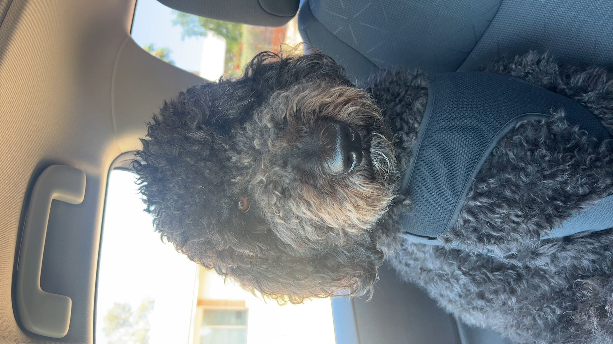

# Aman's Webpage!
***second year computer science student at UCSD***

*Hello here is a picture of my dog:*

> I like coding!

` print("Hello World")`

[Navigate to Section 2: Lists](https://amankdhillon.github.io/CSE110/index.md#section-2-lists)

[This is the website I used to learn how to use Markdown](https://docs.github.com/en/get-started/writing-on-github/getting-started-with-writing-and-formatting-on-github/basic-writing-and-formatting-syntax)

[Navigate to my README](README.md)

## Section 2: Lists

### Here is a list of coding languages I know
- Java
- Python
- C
- C++

### Here is the order I learned these languages
1. Python
2. C++
3. Java
4. C

### Here is a task list of things I need to get done
- [x] This assignment
- [ ] CSE 190 Lab
- [ ] COGS 108 Assignment
